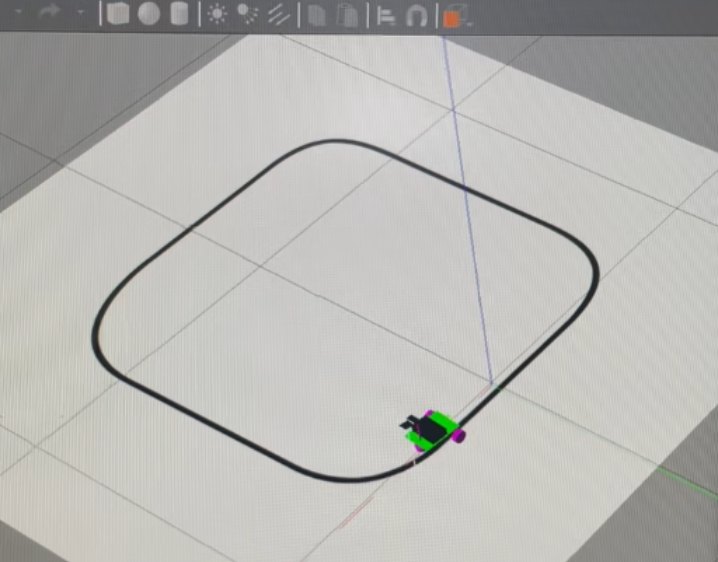
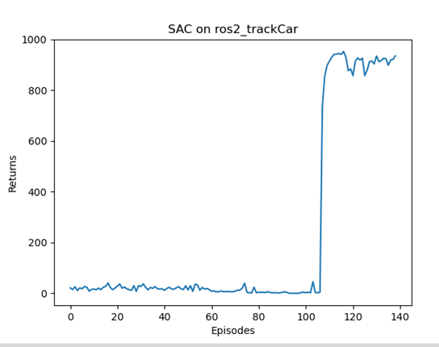

## 使用强化学习在ROS2中实现巡线小车


### 编译
工作空间目录下，使用`colcon build`编译


在工作空间目录下`source install/setup.sh`

### 模型训练
use_gui:=true将会打开gazebo GUI界面，训练为了资源，使用无界面形式

1. 启动环境
2. 启动训练
```
ros2 launch robot_description gazebo.launch.py use_gui:=false

ros2 run auto_control track_car_train
```

### 模型测试
```
ros2 run auto_control track_car_test
```

### 结果







## 一些调试记录

cmd_vel中设定目标角速度为正，向左转
比如：
-0.5向左转
+0.5向右转
但是订阅odom查看到的值是相反的值


### TODO
1. 测试修改状态空间为原来的5个区域 和 1个黑线中值(状态空间中的速度是否真的有用??)
2. 使用当前的状态空间在AC和DDPG中做测试
